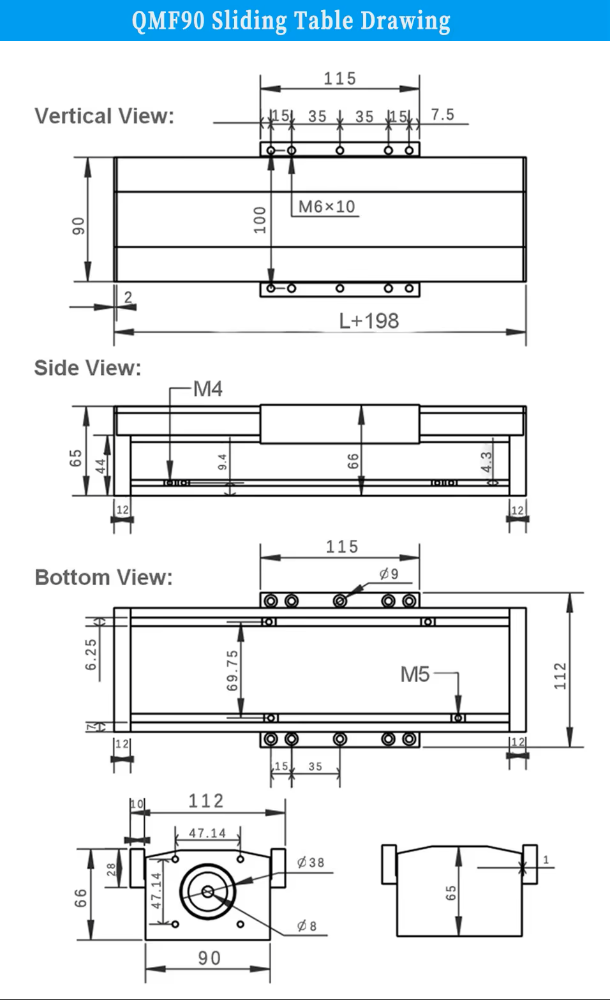
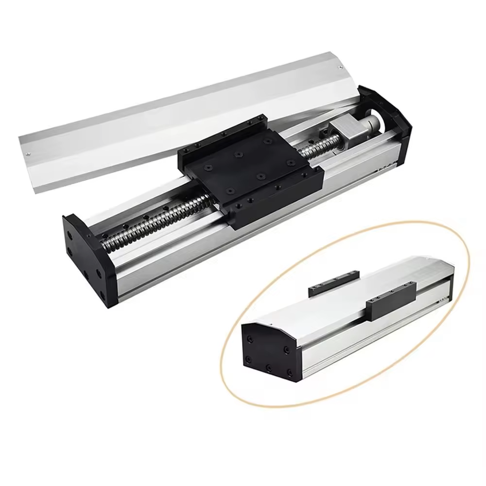

## Purchase Links

[AliExpress Page](https://www.aliexpress.us/item/3256807357569305.html)
[Orders](https://www.aliexpress.com/p/order/index.html)

## Sliding Table Technical Parameters
- Model: QMF90
- Ballscrew type: SFU1605
  - Screw Diameter 16mm
  - Pitch 5mm (linear travel of 5mm per rev)
- Ballscrew accuracy: C7 level
- Effective stroke: 100mm-300mm Optional
- Total length: Effective stroke + 170mm
- Module width: 90mm
- Guide diameter: 12mm
- Guide Type: 2x MGN12
- Horizontal load: Max 70 kg
- Vertical load: Max 35 kg
- Maximum speed: 250mm/s
- Ballscrew Repeat positioning accuracy: 0.03-0.05mm
- Motor bracket motor support: Nema 23 stepper motor
- Base plate material: Aluminium alloy

## Drawings

